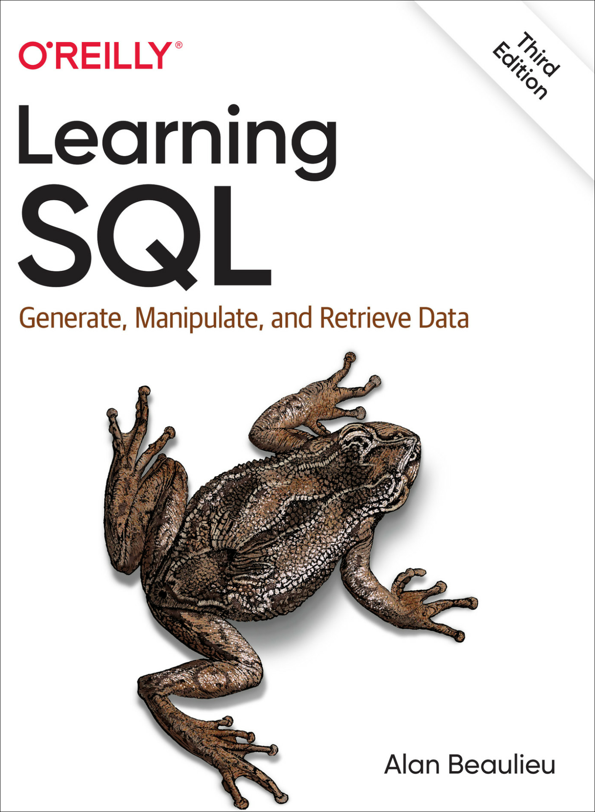

# My notes from "Learning SQL" by Alan Beaulieu



## Book Resources
- [Example MySQL Databases](https://dev.mysql.com/doc/index-other.html)

## Helpful Commands

```bash
mysql -u <username> -p              -- login to mysql
mysql -u <username> -p <database>   -- login to mysql and use a specific database
```

```sql
-- General SQL statements
mysql> show databases;                     -- show all databases
mysql> use <database>;                     -- use a specific database
```


## Chapter 2: Creating and Populating a Database

### MySQL Data Types

- [MySQL Reference - Data Types](https://dev.mysql.com/doc/refman/8.4/en/data-types.html)

#### Character Data
- Stored as fixed-length or variable-length strings.
- Fixed-length strings are right-padded with spaces and always consume the same
  number of bytes
- Variable-length strings are stored with a length prefix and consume only the
  number of bytes needed to store the string.
- Variable-length strings are not right-padded with spaces.

Example:
```sql
char(20)                -- Fixed-length string of 20 characters
varchar(20)             -- Variable-length string of up to 20 characters
```

- Maximum length for `char` columns is 255 bytes
- `varchar` columns can be up to 65,535 bytes

- There are other text types, e.g. `mediumtext` and `longtext`, for storing longer strings, .e.g. emails, XML documents.

**Rule of Thumb**: use the `char` type when all strings are of the same length, such as state abbreviations.

#### Text Data

There are four types of text data:
- `tinytext` - 255 bytes
- `text` - 65,535 bytes
- `mediumtext` - 16,777,215 bytes
- `longtext` - 4,294,967,295 bytes

Things to remember:
- If data being loaded is larger than the maximum size of the column, it will be truncated.
- Trailing spaces are not removed
- When using `text` columns for sorting or grouping, only the first 1,024 bytes are used
- The different text types above are unique to MySQL. SQL Server has a single text type for large character data
- MySQL allows up to 65,535 bytes for `varchar` columns (it was limited to 255 bytes in earlier versions), so there isn't any particular need to use the `tinytext` or `text` types.

If you are creating a column for free-form entry, such as a `notes` column to hold about customer interactions, then `varchar` is probably adequate. If you are storing documents, then use the `mediumtext` or `longtext` type.

#### Numeric Data

There are five different numeric types, each with a signed range and an unsigned range.

**Integer Types**
Here is a table showing the MySQL integer types:

| Type        | Signed Range                    | Unsigned Range     |
| ----------- | ------------------------------- | ------------------ |
| `tinyint`   | -128 to 127                     | 0 to 255           |
| `smallint`  | -32,768 to 32,767               | 0 to 65,535        |
| `mediumint` | -8,388,608 to 8,388,607         | 0 to 16,777,215    |
| `int`       | -2,147,483,648 to 2,147,483,647 | 0 to 4,294,967,295 |
| `bigint`    | -2^63 to 2^63 - 1               | 0 to 2^64 - 1      |

**Floating Types**
Floating point types include the `double` and `float`. Tehse types are specified as `float(p ,s)` and `double(p, s)`, where `p` is the precision and `s` is the scale. The precision is the total number of digits that can be stored, and the scale is the number of digits to the right of the decimal point.

Examples:
```sql
float(7, 4)            -- 7 digits total, 4 digits to the right of the decimal, i.e. 123.4567
double(16, 8)          -- 16 digits total, 8 digits to the right of the decimal, i.e. 12345678.12345678
```

Existing numbers that that have more precision will be rounded while attempting to store a number with greater precision will result in an error.

**Temporal Data**
The following table shows the MySQL temporal types, including the default format and the allowable values:

| Type        | Format              | Allowable Values                                   |
| ----------- | ------------------- | -------------------------------------------------- |
| `date`      | YYYY-MM-DD          | 1000-01-01 to 9999-12-31                           |
| `datetime`  | YYYY-MM-DD HH:MM:SS | 1000-01-01 00:00:00 to 9999-12-31 23:59:59         |
| `timestamp` | YYYY-MM-DD HH:MM:SS | 1970-01-01 00:00:01 UTC to 2038-01-19 03:14:07 UTC |
| `time`      | HH:MM:SS            | -838:59:59 to 838:59:59                            |
| `year`      | YYYY                | 1901 to 2155                                       |

Practical examples:  
- Columns to hold future shipping date would use the `date` type
- A column that holds information about actual shipping would use the `datetime` type
- A column that tracks when a user last modified a record would use the `timestamp` type
- Columns that hold data regarding the length of time to complete a task would use the `time` type