# My notes from "Learning SQL" by Alan Beaulieu


<details>
<summary>Book Resources</summary>

- [Example MySQL Databases](https://dev.mysql.com/doc/index-other.html)
- <details>
  <summary>Sakila Database Schema</summary>
  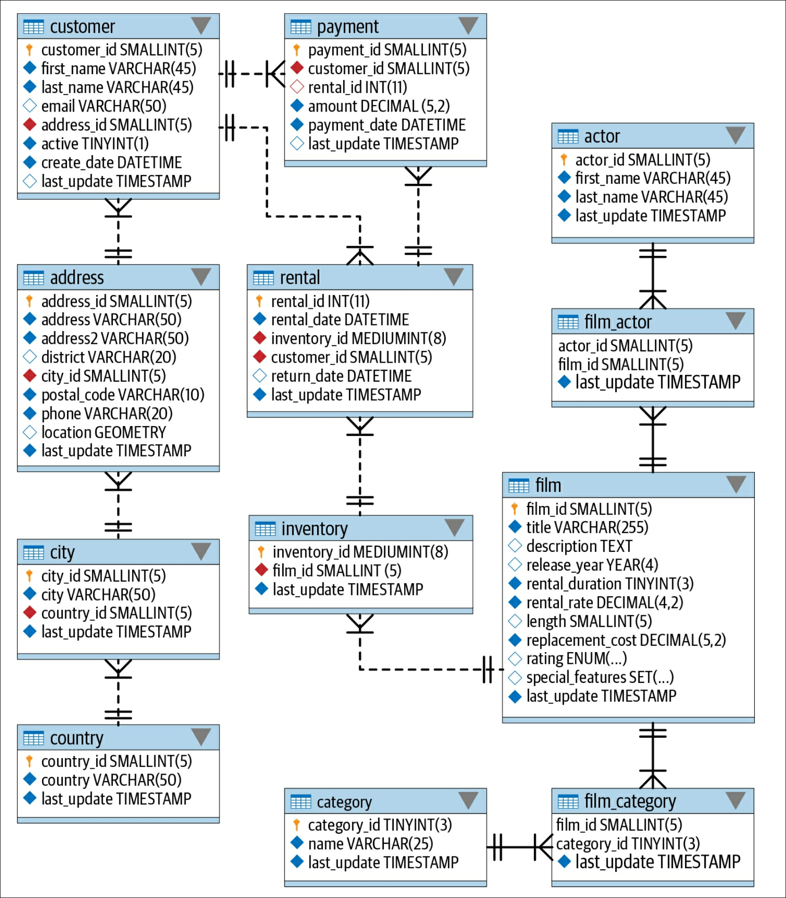
  </details>

</details>

<!-- omit in toc -->
## Helpful Commands

```bash
# Shell commands
mysql -u <username> -p                          # login to mysql; the -p option prompts for a password
mysql -u <username> -p <database>               # login to mysql and use a specific database
mysql -u <username> -p <database> < script.sql  # run a script
mysql -u <username> -p <database> --xml         # show results in XML format
```

```sql
-- General MySQL statements
mysql> show databases;                     -- show all databases
mysql> use <database>;                     -- use a specific database
mysql> show tables;                        -- show all tables in the current database
mysql> desc <table>;                       -- show the structure of a table
mysql> select * from <table>;              -- select all rows from a table
```

<!-- omit in toc -->
## Contents
- [Chapter 2: Creating and Populating a Database](#chapter-2-creating-and-populating-a-database)
  - [MySQL Data Types](#mysql-data-types)
    - [Character Data](#character-data)
    - [Text Data](#text-data)
    - [Numeric Data](#numeric-data)
      - [Integer Types](#integer-types)
      - [Floating-Point Types](#floating-point-types)
      - [Temporal Types](#temporal-types)
    - [Table Creation](#table-creation)
    - [Populating and Modifying the Tables](#populating-and-modifying-the-tables)
      - [Inserting Data](#inserting-data)
      - [Updating Data](#updating-data)
      - [Deleting Data](#deleting-data)
    - [When Good Statements Go Bad](#when-good-statements-go-bad)
      - [Non-unique Primary Key](#non-unique-primary-key)
      - [Nonexistent Foreign Key](#nonexistent-foreign-key)
      - [Column Value Violations](#column-value-violations)
      - [Invalid Date Conversions](#invalid-date-conversions)
    - [The Sakila Database](#the-sakila-database)
- [Chapter 3: Query Primer](#chapter-3-query-primer)
  - [Query Mechanics](#query-mechanics)
  - [Query Clauses](#query-clauses)
  - [The `select` Clause](#the-select-clause)


## Chapter 2: Creating and Populating a Database

### MySQL Data Types

- [MySQL Reference - Data Types](https://dev.mysql.com/doc/refman/8.4/en/data-types.html)

#### Character Data
- Stored as fixed-length or variable-length strings.
- Fixed-length strings are right-padded with spaces and always consume the same
  number of bytes
- Variable-length strings are stored with a length prefix and consume only the
  number of bytes needed to store the string.
- Variable-length strings are not right-padded with spaces.

Example:
```sql
char(20)                -- Fixed-length string of 20 characters
varchar(20)             -- Variable-length string of up to 20 characters
```

- Maximum length for `char` columns is 255 bytes
- `varchar` columns can be up to 65,535 bytes

- There are other text types, e.g. `mediumtext` and `longtext`, for storing longer strings, .e.g. emails, XML documents.

**Rule of Thumb**: use the `char` type when all strings are of the same length, such as state abbreviations.

#### Text Data

MySQL offers four text data types for storing larger strings:

| Type         | Maximum Size        | Best Use Case               |
| ------------ | ------------------- | --------------------------- |
| `tinytext`   | 255 bytes           | Short text                  |
| `text`       | 65,535 bytes        | Medium-length documents     |
| `mediumtext` | 16,777,215 bytes    | Larger documents            |
| `longtext`   | 4,294,967,295 bytes | Very large documents, files |

Important notes:
- Data exceeding column size will be truncated
- Trailing spaces are preserved
- For sorting/grouping, only the first 1,024 bytes are used
- `varchar` (up to 65,535 bytes) often eliminates the need for `tinytext`/`text` 
- Choose `varchar` for short free-form entries (e.g., notes fields) and `mediumtext`/`longtext` for document storage.

#### Numeric Data

MySQL provides several numeric data types for different storage needs.

##### Integer Types

| Type        | Signed Range                    | Unsigned Range     |
| ----------- | ------------------------------- | ------------------ |
| `tinyint`   | -128 to 127                     | 0 to 255           |
| `smallint`  | -32,768 to 32,767               | 0 to 65,535        |
| `mediumint` | -8,388,608 to 8,388,607         | 0 to 16,777,215    |
| `int`       | -2,147,483,648 to 2,147,483,647 | 0 to 4,294,967,295 |
| `bigint`    | -2^63 to 2^63 - 1               | 0 to 2^64 - 1      |

#####  Floating-Point Types

For decimal values, MySQL offers `float` and `double` types with syntax `float(p, s)` or `double(p, s)`:
- `p` = precision (total digits)
- `s` = scale (digits after decimal point)

Examples:
```sql
float(7, 4)     -- Stores values like 123.4567
double(16, 8)   -- Stores values like 12345678.12345678
```

Note: Values exceeding specified precision will be rounded; attempting to store values with too many digits before the decimal point causes an error.

##### Temporal Types

The following table shows the MySQL temporal types, including the default format and the allowable values:

| Type        | Format              | Allowable Values                                   |
| ----------- | ------------------- | -------------------------------------------------- |
| `date`      | YYYY-MM-DD          | 1000-01-01 to 9999-12-31                           |
| `datetime`  | YYYY-MM-DD HH:MI:SS | 1000-01-01 00:00:00 to 9999-12-31 23:59:59         |
| `timestamp` | YYYY-MM-DD HH:MI:SS | 1970-01-01 00:00:01 UTC to 2038-01-19 03:14:07 UTC |
| `time`      | HHH:MMI:SS          | -838:59:59 to 838:59:59                            |
| `year`      | YYYY                | 1901 to 2155                                       |

Practical examples:  
- Columns to hold future shipping date would use the `date` type
- A column that holds information about actual shipping would use the `datetime` type
- A column that tracks when a user last modified a record would use the `timestamp` type
- Columns that hold data regarding the length of time to complete a task would use the `time` type

The following table shows the date format components.

| Component | Definition              | Range                         |
| --------- | ----------------------- | ----------------------------- |
| `YYYY`    | Year, including centruy | 1000 to 9999                  |
| `MM`      | Month                   | 01 (January) to 12 (December) |
| `DD`      | Day of the month        | 01 to 31                      |
| `HH`      | Hour of the day         | 00 to 23                      |
| `HHH`     | Hours (elapsed)         | -838 to 838                   |
| `MI`      | Minutes                 | 00 to 59                      |
| `SS`      | Seconds                 | 00 to 59                      |

#### Table Creation

The following example illustrates the design of a table using basic normalization:


The following script creates the `person` table:

```sql
CREATE TABLE person (
    person_id SMALLINT UNSIGNED,
    fname VARCHAR(20),
    lname VARCHAR(20),
    eye_color ENUM('BR','BL','GR'),
    birth_date DATE,
    street VARCHAR(30),
    city VARCHAR(20),
    state VARCHAR(20),
    country VARCHAR(20),
    postal_code VARCHAR(20),
    CONSTRAINT pk_person PRIMARY KEY (person_id)
);
```
[create_person_table.sql](./ch02/create_person_table.sql).

To run this script, issue the following command:

```bash
mysql -u <username> -p <database> < create_person_table.sql
```
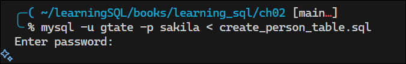

To confirm the table was created, issue the `describe` command:

```sql
desc person;
```
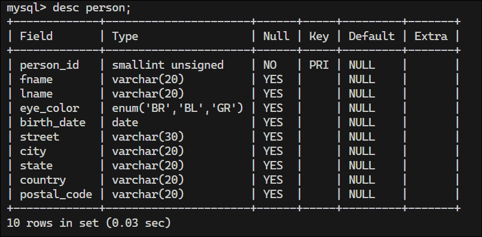

Things to note:
- Column 3 `Null` indicates whether a column can be omitted when inserting data.
- Column 5 `Default` indicates whether a column can be populated with a default value.
- Column 6 `Extra` shows any other pertinent information about the column.

Since a person can have multiple favorite foods, we create a separate table, `favorite_food`, to store this information.

```sql
CREATE TABLE
    favorite_food (
        person_id SMALLINT UNSIGNED,
        food VARCHAR(20),
        CONSTRAINT pk_favorite_food PRIMARY KEY (person_id, food),
        CONSTRAINT fk_fav_food_person_id FOREIGN KEY (person_id) REFERENCES person (person_id)
    )
```
[create_favorite_food.sql](./ch02/create_favorite_food.sql).

To run this script, issue the following command:

```bash
mysql -u <username> -p <database> < create_favorite_food.sql
```
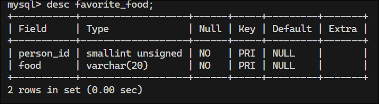

Things to note:
- The `PRIMARY KEY` constraint ensures that the combination of `person_id` and `food` is unique.
- The `FOREIGN KEY` constraint constrains the `person_id` column to only accept values that exist in the `person` table.

#### Populating and Modifying the Tables

With the tables created, you can now explore the four SQL data statments: `insert`, `update`, `delete`, and `select`.

##### Inserting Data

There are three main components to the `insert` statement:
- The name of the table into which you want to insert data
- The names of the columns in the table to be populated
- The values to be inserted into the columns

Unless all the columns have been defined with the `NOT NULL` constraint, you are not required to provide data for every column in the table. This means you can leave off columns that are not required.

###### Generating numeric key data

How are values generated for numeric primary keys? A couple of options:
- Look at largest value in the table and add 1
- Let the database engine generate the value for you

The first option is not a good idea because it proves problematic in a multi-user environment, since two users could be trying to insert data at the same time. The second option is a better choice, and MySQL provides the `AUTO_INCREMENT` attribute to do this:

`ALTER TABLE person MODIFY person_id SMALLINT UNSIGNED AUTO_INCREMENT;`

**Output:**  


The output gives an error because you first need to disable the foreign key constraint on the `favorite_food` table. The following progession of statements will do this:

```sql
set foreign_key_checks = 0;
ALTER TABLE person
    MODIFY person_id SMALLINT UNSIGNED AUTO_INCREMENT;
set foreign_key_checks = 1;
```
[alter_table_auto_increment.sql](./ch02/alter_table_auto_increment.sql)  

**Output:**  
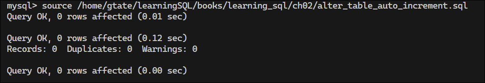

Running the `desc` command on the `person` table shows that the `AUTO_INCREMENT` attribute has been added to the `person_id` column.

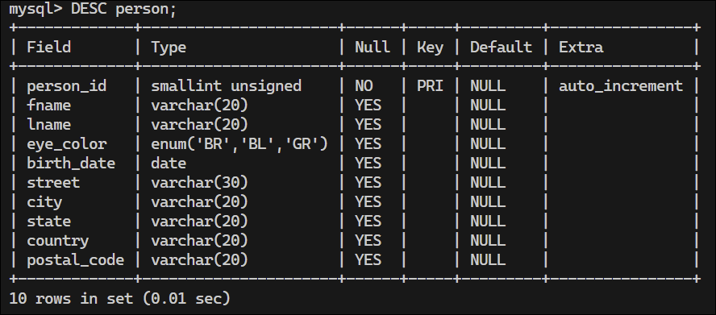

When inserting data into the `person` table, you provide a `null` value for the `person_id` column. The database engine will automatically generate the next available number for you.

###### The `insert` statement

The following statement creates a row in the `person` table:

```sql
INSERT INTO person
  (person_id, fname, lname, eye_color, birth_date) 
VALUES (null, 'William', 'Turner', 'BR', '1972-05-27');
```

To confirm data was inserted, issue the following command:

```sql
SELECT person_id, fname, lname, birth_date FROM person;
```
**Output:**  
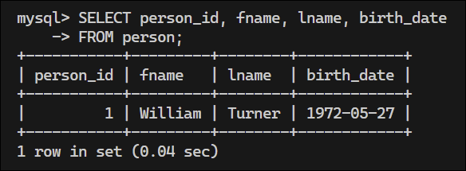

**Note:** MySQL automatically generates the `person_id` value, in this case `1`.

If there were more rows in the table, you can add a `WHERE` clause to the `SELECT` statement to limit the output:

```sql
SELECT person_id, fname, lname, birth_date
FROM person
WHERE person_id=1;
```
**Output:**  
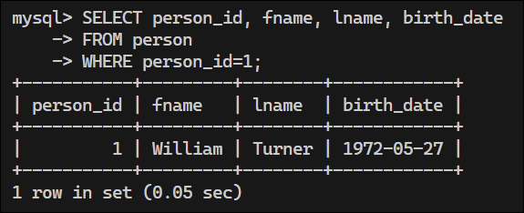

**Note:**  
- Values were not provided for the `street`, `city`, `state`, `country`, and `postal_code` columns, so they are set to `null`.
- The value provided for `birth_date` is a string, which is converted to a date value by MySQL (as long as the string is in the correct format).
- The column names and values must correspond in number and type.

The following statements show inserting William's favorite foods into the `favorite_food` table:

```sql
INSERT INTO favorite_food (person_id, food)
VALUES (1, 'pizza');
K, 1 row affected (0.05 sec)

INSERT INTO favorite_food (person_id, food)
VALUES (1, 'cookies');
K, 1 row affected (0.02 sec)

INSERT INTO favorite_food (person_id, food)
VALUES (1, 'nachos');
```
**Output:**  
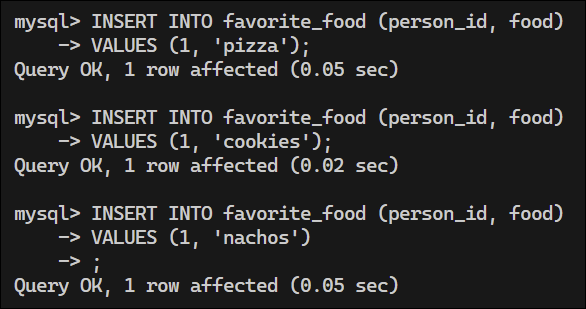

The following query retrieves William's favorite foods in alphabetical order:

```sql
SELECT food 
FROM favorite_food 
WHERE person_id = 1
ORDER BY food;
```
**Output:**  
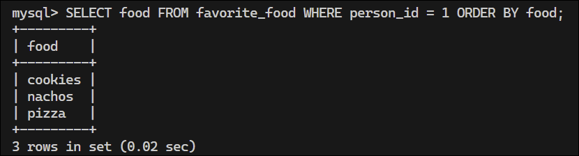

Adding Susan to the `person` table, including her address columns:

```sql
INSERT INTO person (person_id, fname, lname, eye_color, birth_date, street, city, state, country, postal_code) 
VALUES (null, 'Susan', 'Smith', 'BL', '1975-11-02', '23 Maple St.', 'Arlington', 'VA', 'USA', '20220');
```
Querying the `person` table shows that Susan's `person_id` is `2`:  
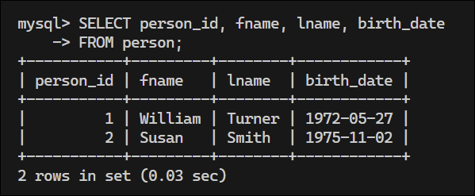


###### Outputting in XML

With MySQL, you can use the `--xml` option to output the results of a query in XML format. This is useful for exporting data to other applications or for web services.

```bash
mysql -u gtate -p --xml sakila
```

Example output:  
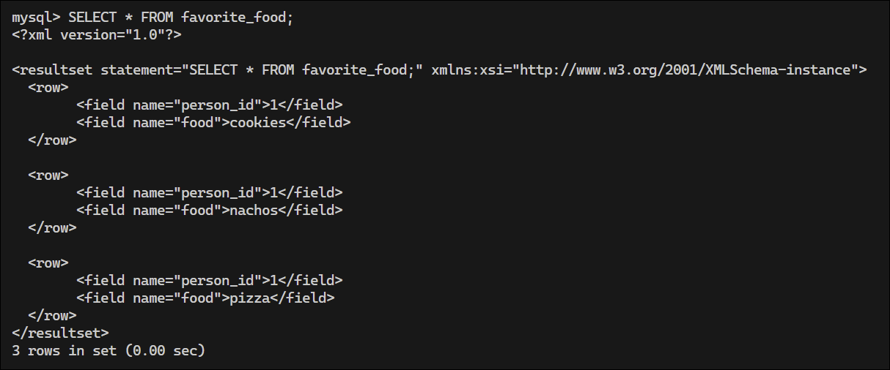


##### Updating Data

Use the following command to populate columns in the `person` table that were not populated when the row was created:

```sql
UPDATE person
SET street = '1225 Tremont St.',
  city = 'Boston',
  state = 'MA',
  country = 'USA',
  postal_code = '02138'
WHERE person_id = 1;
```
**Output:**  
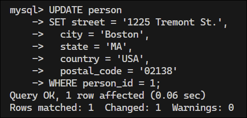

##### Deleting Data

Use the following command to delete a row from the `person` table:

```sql
DELETE FROM person
WHERE person_id = 2;
```
**Output:**  
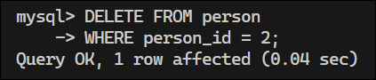

**Note:** The primary key is used to identify the row to be deleted. If you do not specify a `WHERE` clause, all rows in the table will be deleted.

#### When Good Statements Go Bad

##### Non-unique Primary Key

The next statement attempts to bypass the `AUTO_INCREMENT` attribute by inserting a value into the `person_id` column:

```sql
INSERT INTO person
  (person_id, fname, lname, eye_color, birth_date)
VALUES (1, 'Charles', 'Fulton', 'GR', '1968-01-15');
```
**Output:**  
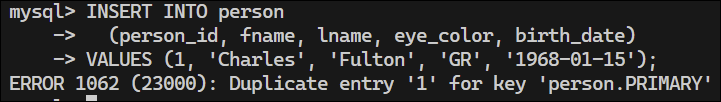

##### Nonexistent Foreign Key

The foreign key constraint on the `favorite_food` table ensures that all values of `person_id` in the `favorite_food` table exist in the `person` table. The following statement attempts to insert a row into the `favorite_food` table with a `person_id` that does not exist in the `person` table:

```sql
INSERT INTO favorite_food (person_id, food)
VALUES (999, 'lasagna');
```
**Output:**  
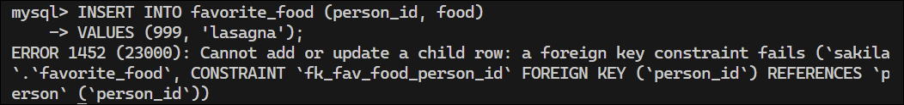

**Note:** The `favorite_food` table is considered the child table, and the `person` table is the parent table.

##### Column Value Violations

The `eye_color` column in the `person` table is defined as an `ENUM` type, which means it can only accept a limited set of values. The following statement attempts to insert a value that is not in the list of allowed values:

```sql
UPDATE person
SET eye_color = 'ZZ'
WHERE person_id = 1;
```
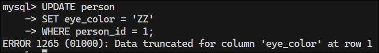

##### Invalid Date Conversions

If you construct a date string that is not in the correct format, MySQL will not be able to convert it to a date value. The following statement attempts to insert an invalid date string into the `birth_date` column:

```sql
UPDATE person
SET birth_date = 'DEC-21-1980'
WHERE person_id = 1;
```
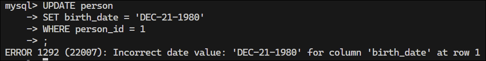

In general, it's always a good idea to explicitly specify the format string rather than relying on MySQL to guess the format. The following statement uses the `str_to_date` function to specify the format of the date string:

```sql
UPDATE person
SET birth_date = str_to_date('DEC-21-1980', '%b-%d-%Y')   -- %Y = 4-digit year, %b = abbreviated month name
WHERE person_id = 1;
```
**Output:**  
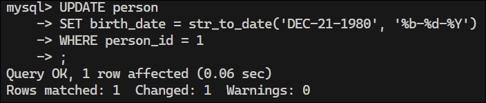

###### Formatting Strings

The following table shows the format strings that can be used with the `str_to_date` function:


| Format | Description                                        |
| ------ | -------------------------------------------------- |
| %a     | The short weekday name, such as Sun, Mon, ...      |
| %b     | The short month name, such as Jan, Feb, ...        |
| %c     | The numeric month (0..12)                          |
| %d     | The numeric day of the month (00..31)              |
| %f     | The number of microseconds (000000..999999)        |
| %H     | The hour of the day, in 24-hour format (00..23)    |
| %h     | The hour of the day, in 12-hour format (01..12)    |
| %i     | The minutes within the hour (00..59)               |
| %j     | The day of year (001..366)                         |
| %M     | The full month name (January..December)            |
| %m     | The numeric month                                  |
| %p     | AM or PM                                           |
| %s     | The number of seconds (00..59)                     |
| %W     | The full weekday name (Sunday..Saturday)           |
| %w     | The numeric day of the week (0=Sunday..6=Saturday) |
| %Y     | The four-digit year                                |


#### The Sakila Database

Produced by MySQL. Models a chain of DVD rental stores.


Some of the tables used:

| Table name | Definition                                       |
| ---------- | ------------------------------------------------ |
| film       | A movie that has been released and can be rented |
| actor      | A person who acts in films                       |
| customer   | A person who watches films                       |
| category   | A genre of films                                 |
| payment    | A rental of a film by a customer                 |
| language   | A language spoken by the actors of a film        |
| film_actor | An actor in a film                               |
| inventory  | A film available for rental                      |

Use `show tables` to see all tables in the Sakila database:

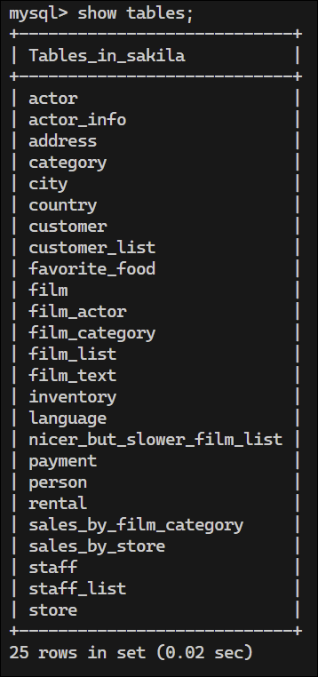

The tables `person` and `favorite_food` are not part of the Sakila database, but were created in this chapter to illustrate how to create and populate tables. 

Use the following command to drop these tables:

```sql
DROP TABLE favorite_food;
DROP TABLE person;
```

Use `describe` to look at the columns in a table:

```sql
desc customer;
```
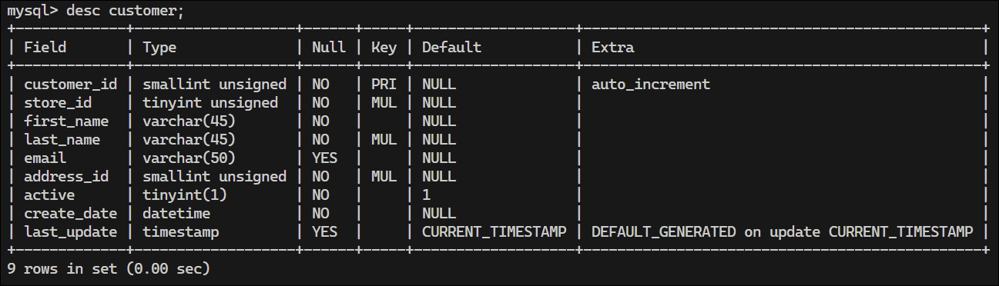

## Chapter 3: Query Primer

### Query Mechanics

After logging into MySQL, each time a query is sent, the server checks the following things:
1. Do you have permission to execute the statement?
2. Do you have permission to access the desired resource?
3. Is your syntax correct?

If your statement passes these checks, then your query is handed to the *query optimizer*. The query optimizer's job is to determine the most efficient way to execute the query based on the current database schema, available indexes, and statistics about the data. The optimizer looks at things the order in which to join the tables and the indexes available, and then pics an *execution plan*, which the server uses to execute your query.

Once the server finishes executing your query, the *result set* is returned to the calling application, which is the `mysql` tool. The result set is just another table.

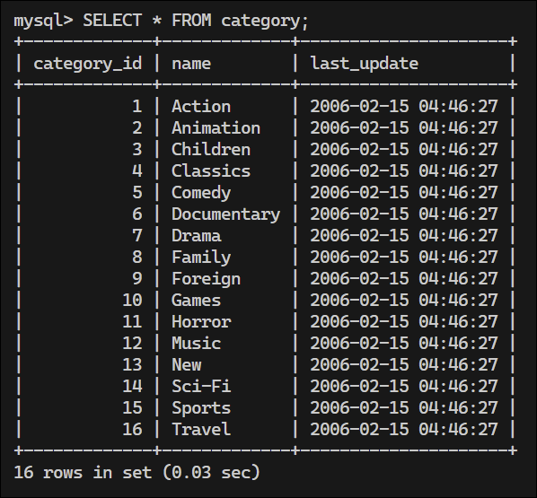


### Query Clauses

Several clauses make up the `select` statement:

| Clause name | Purpose                                                                |
| ----------- | ---------------------------------------------------------------------- |
| select      | Determines which columns to include in the query’s result set          |
| from        | Identifies the tables from which to retrieve data and how to join them |
| where       | Filters out unwanted data                                              |
| group by    | Used to group rows together by common column values                    |
| having      | Filters out unwanted groups                                            |
| order by    | Sorts the rows of the final result set by one or more columns          |

### The `select` Clause

The `select` clause is the first clause of a `select` statement. It is one of the last clauses that the database server evaluates. The `from` clause is the second clause of a `select` statement. It identifies the tables from which to retrieve data and how to join them.

```sql
mysql> SELECT * 
    -> FROM language;
```
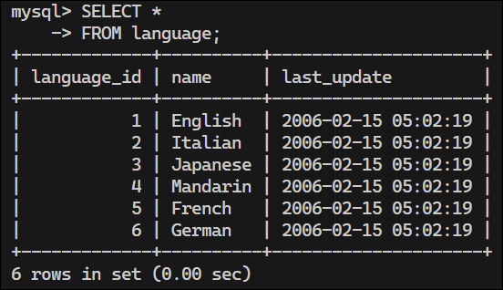

```sql
mysql> SELECT language_id, name, last_update
    -> FROM language;
```
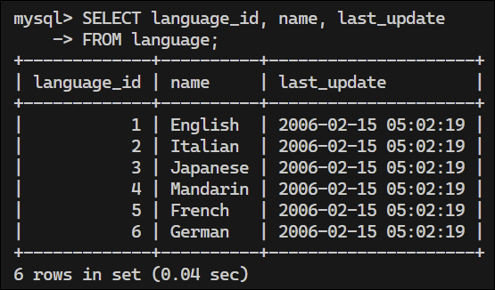

```sql
mysql> SELECT name
    -> FROM language;
```
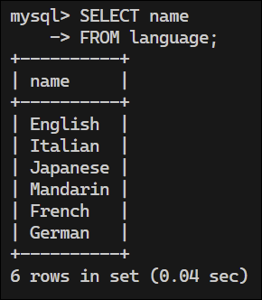

In addition to column names, you can include:
- Literals, such as strings or numbers
- Expressions, such as `transaction.amount * -1`
- Built-in function calls, such as `ROUND(transaction.amount, 2)`
- User-defined function calls, such as `my_function(transaction.amount)`

```mysql
mysql> SELECT language_id,
    ->   'COMMON' language_usage,
    ->   language_id * 3.1415927 lang_pi_value,
    ->   upper(name) language_name
    -> FROM language;
```
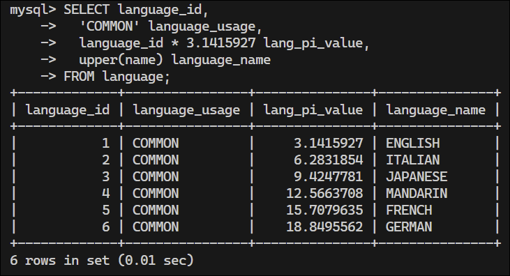
